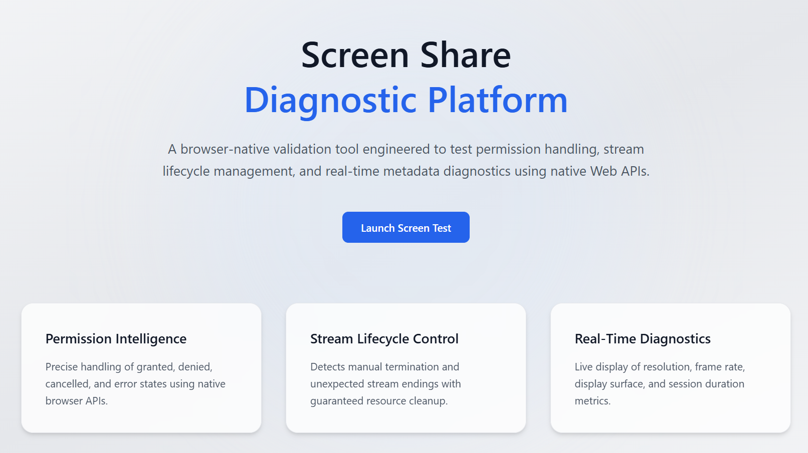
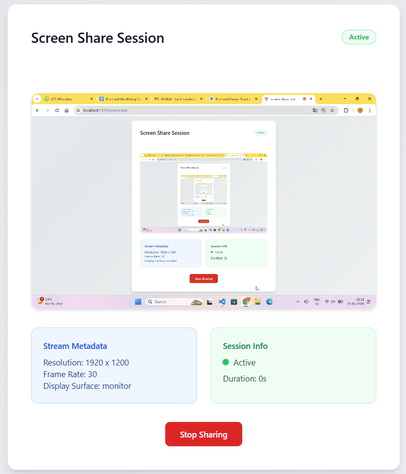

# Screen Share Test App

A browser-native screen sharing validation tool built using React (Vite) and TypeScript.

This application demonstrates robust permission handling, media stream lifecycle management, real-time metadata diagnostics, and clean React state management using native browser Web APIs.

---

## 🚀 Live Demo

https://screen-share-diagnostic.vercel.app/

---

## Tech Stack

- React (Vite)
- TypeScript
- Tailwind CSS
- React Router
- Native Web APIs (`navigator.mediaDevices.getDisplayMedia`)

No third-party screen-sharing libraries are used.

---

# Explanation of Screen-Sharing Flow

The screen-sharing lifecycle follows a structured state-driven approach.

###  Homepage Validation

Before navigation to the screen test page:

- The app verifies:
  
  ```js
  navigator.mediaDevices.getDisplayMedia
  ```

- If unsupported:
  - Navigation is blocked
  - A browser-unsupported message is shown

---

### Permission Request

When the user clicks **Start Screen Sharing**, the app calls:

```js
navigator.mediaDevices.getDisplayMedia({
  video: { frameRate: { ideal: 30 } },
  audio: false
})
```

The UI reflects distinct states:

- `requesting` – Waiting for user selection
- `granted` – Screen stream active
- `denied` – Permission rejected
- `cancelled` – User closed picker
- `error` – Unexpected failure

Each state renders a specific UI message.

---

### Live Preview & Metadata

Once granted:

- The stream attaches to a `<video>` element using:

  ```js
  videoRef.current.srcObject = stream;
  ```

- Metadata is extracted using:

  ```js
  track.getSettings()
  ```

Displayed information:

- Resolution
- Frame rate
- Display surface (monitor / window / tab)
- Live session duration

No recording or backend streaming occurs.
Preview is strictly local.

---

### Lifecycle Detection

The app listens for manual stop events using:

```js
track.onended
```

If the user stops sharing from browser UI:

- UI updates immediately
- All media tracks are stopped
- Video element is cleared
- Duration timer is cleared
- Status transitions to `stopped`

This prevents memory leaks and stale streams.

---

### Retry Flow

After stopping:

- User sees:
  - "Screen sharing stopped"
  - Retry Screen Test button
  - Back to Home button

Retry always triggers a fresh `getDisplayMedia()` request.
Old streams are never reused.

---

# Setup Instructions

### Clone the repository

```bash
git clone https://github.com/mounika281005/screen-share-diagnostic.git
cd screen-share-diagnostic
```

### Install dependencies

```bash
npm install
```

### Start development server

```bash
npm run dev
```

Open:

```
http://localhost:5173
```

---

# Screenshots

###  Home Page



---

### Active Screen Sharing Session



---

### Permission Denied State


---

# Known Limitations & Browser Quirks

- Screen sharing requires:
  - HTTPS OR
  - `localhost`

- `displaySurface` support may vary between browsers.

- Screen sharing is not supported on most mobile browsers.

- Some browsers may label permission denial and cancellation differently.

- The app does not record or store media data — preview only.

---

# Browser Support

Tested on:

- Google Chrome (Latest)
- Microsoft Edge (Latest)

---

# Architectural Highlights

- Screen-sharing logic isolated in custom hook: `useScreenShare`
- Event-driven lifecycle detection using `track.onended`
- Defensive cleanup to prevent memory leaks
- Strict TypeScript typing
- Stateless UI components
- Reusable Button component
- No UI libraries or templates

---

## Author

Mounika Karri
